# Active-Directory-Homelab
A homelab to show competence and literacy of Active Directory and important skills like group policy, managing users, and creating a DC and Client in VirtualBox.

# Active Directory Home Lab (Windows Server 2022)

> **Status:** Finished. Domain controller promoted, NAT routing and DHCP working, about 1,000 users created with PowerShell, a Windows 10 client joined to the domain, and Group Policy built and verified as enforced on that client.

---

## What This Is
I built an Active Directory domain from scratch in VirtualBox to learn the environment IT support actually works in.

The lab runs a Windows Server 2022 domain controller handling DNS, DHCP, and NAT routing for an isolated internal network, with a Windows 10 client joined to the domain. I created about 1,000 users with a PowerShell script, and set up Group Policy to enforce account lockout and restrict Control Panel for standard users.

Most of what I actually learned came from things breaking. The three case studies below are the problems that took real troubleshooting, and they're the parts I'd point to first.

---

## What I Did
- Installed and promoted a Windows Server 2022 domain controller
- Set up static addressing, DNS, DHCP, and NAT routing between two network adapters
- Created OUs, a separate admin account, and security group membership
- Bulk-created about 1,000 users with a PowerShell script (`New-ADUser`)
- Built and linked two Group Policy Objects, and troubleshot one that wasn't applying
- Joined a Windows 10 client to the domain and verified login against the DC
- Documented every problem I hit and how I worked through it

---

## Lab Environment

| Component | Details |
|---|---|
| **Host** | Windows 11 |
| **Hypervisor** | Oracle VirtualBox 7.2.12 (+ Extension Pack) |
| **Domain** | `mydomain.com` |
| **VM 1: `dc`** | Windows Server 2022 Standard Evaluation (Desktop Experience) · 4096 MB RAM · 4 vCPU · 50 GB disk |
| **VM 2: `Client1`** | Windows 10 Pro 22H2 · internal network only |

### Network Design
| Adapter | Purpose | Addressing |
|---|---|---|
| `dc`, `Internet` (NAT) | Outbound internet for the server | DHCP from VirtualBox (`10.0.2.15`) |
| `dc`, `Internal` (Internal Network) | Private lab network for clients | Static `172.16.0.1 / 255.255.255.0` |
| `Client1`, `Ethernet` (Internal Network) | Joins the lab network | DHCP from the DC (`172.16.0.100`) |

The DC has two adapters on purpose. One reaches the internet, the other serves the isolated lab network. The DC routes between them, so the client gets internet through the DC. That's roughly how a small office network works.

One thing that confused me for a while: two VMs are connected by the **internal network name** you set in VirtualBox, not by what the adapter is called inside Windows. The Windows name is just a label. The VirtualBox name is what actually wires them together.

---

## Build Process

### 1. Created the Domain Controller VM
Provisioned a VM named `DC` in VirtualBox and attached the Windows Server 2022 evaluation ISO. Configured two network adapters: **Adapter 1 = NAT** (internet) and **Adapter 2 = Internal Network** (lab).

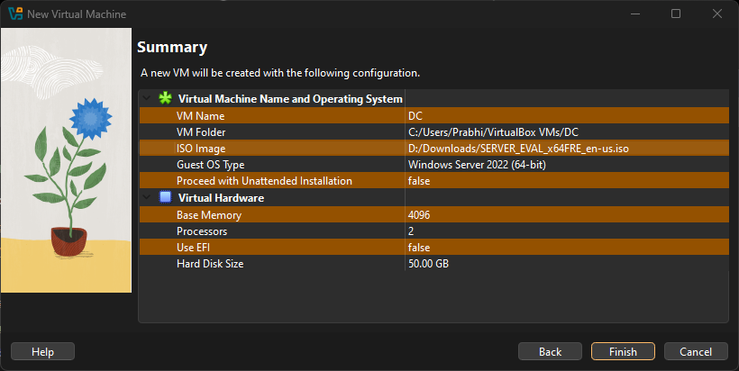

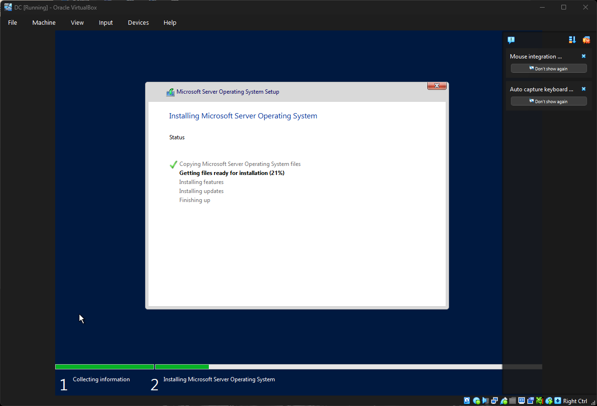

VirtualBox turned on "Proceed with Unattended Installation" by itself. I unchecked it. Unattended setup skips the screen where you pick the edition, and it can quietly install Server Core, which has no GUI.

---

### 2. Installed Windows Server 2022 (Desktop Experience)
I picked **Windows Server 2022 Standard Evaluation (Desktop Experience)**. That's the one with the full GUI and Server Manager. Plain "Standard" installs Server Core, which is command line only.

Chose **Custom: Install Windows only**, installed to the 50 GB virtual disk, and set the built-in Administrator password (complexity enforced: 8+ characters with mixed case, a number, and a symbol).

---

### 3. Installed VirtualBox Guest Additions
Mounted the image via `Devices → Insert Guest Additions CD image` and installed it.

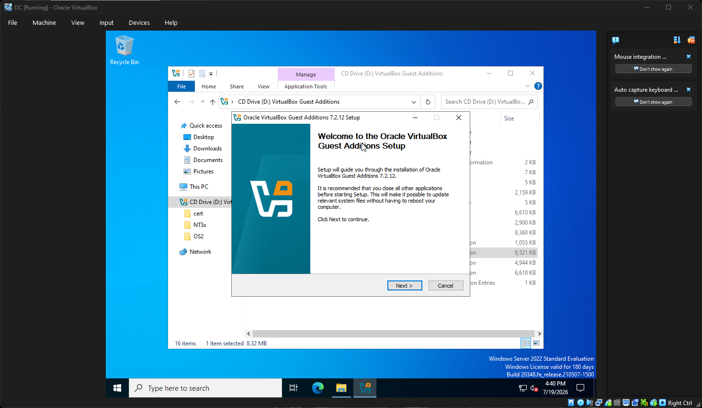

This gives you smooth mouse movement between host and guest, a display that resizes properly, and a shared clipboard. The clipboard turned out to matter most, since it made copying scripts into the VM much easier later on.

---

### 4. Renamed the Network Adapters
I renamed the two NICs by what they do: `Internet` and `Internal`.

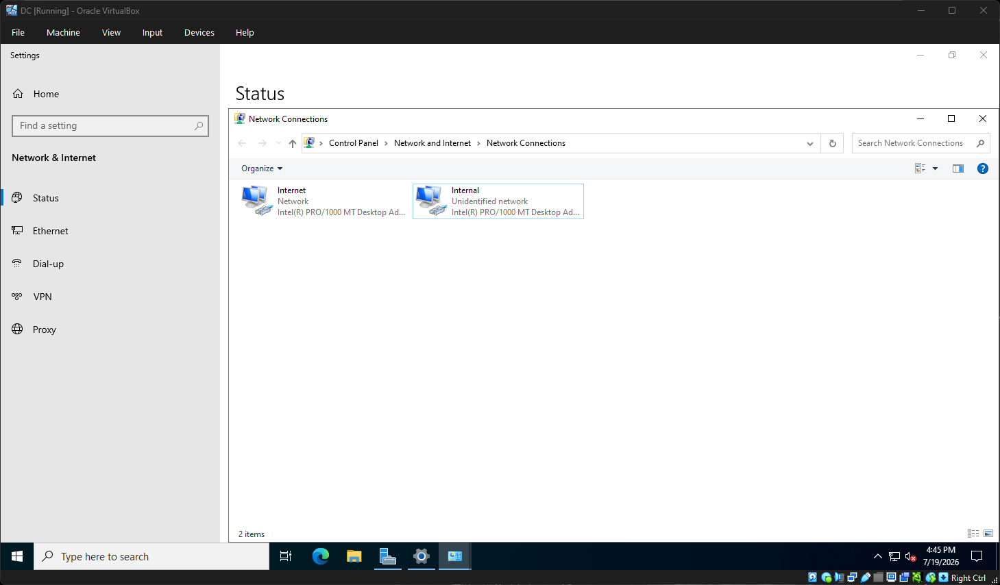

The NAT wizard later asks which interface faces the internet. Both adapters show up as "Intel(R) PRO/1000 MT," so without useful names you're guessing. Naming them by purpose made that step obvious.

---

### 5. Assigned a Static IP to the Internal Adapter

| Setting | Value |
|---|---|
| IP address | `172.16.0.1` |
| Subnet mask | `255.255.255.0` |
| Default gateway | *(intentionally blank)* |
| Preferred DNS | `127.0.0.1` |

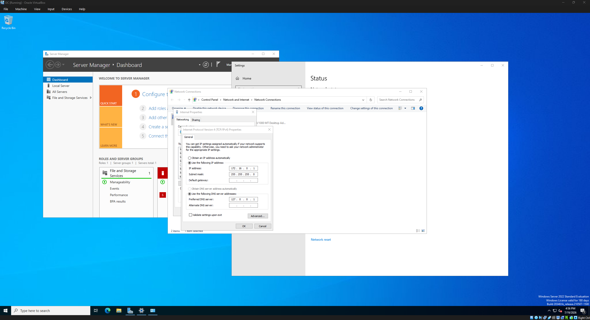

The IP has to be static because every domain-joined machine finds the domain by asking DNS, and this server is the DNS server. If its address changed through DHCP, clients would stop being able to find the domain at all.

I left the gateway blank on purpose. The `Internet` adapter already gets one from DHCP, and putting a second default route on the internal NIC creates conflicting routes. The DC is the gateway for the internal network, it doesn't need one of its own there.

DNS points at `127.0.0.1` because promoting the server installs the DNS role on it, so it resolves against itself.

> ### Something I caught: Windows filled in the wrong subnet mask
>
> When I typed in `172.16.0.1`, Windows auto-filled the subnet mask as `255.255.0.0` (/16) instead of the `255.255.255.0` (/24) I needed.
>
> This happens because Windows still uses the old classful addressing rules. `172.16.x.x` falls in what used to be called the Class B range, so it assumes /16. That convention stopped being how addressing works when CIDR replaced it, but the default is still there.
>
> It mattered because my DHCP scope hands clients a /24 mask. If I'd left the DC on /16, the server and every client it serves would have disagreed about the size of the network. That's the kind of thing that doesn't throw an error. It shows up later as connectivity that works sometimes and not others, which is much harder to track down than something that just fails.
>
> I noticed it before hitting OK and set it to `255.255.255.0` manually.
>
> What I took from it: don't trust an auto-filled subnet mask. Check it against what the network is actually supposed to be.

The `Internal` adapter still shows "Unidentified network." That's expected since it has no gateway and no internet. It isn't an error.

---

### 6. Renamed the Server to `dc`
Renamed the machine from its randomly generated hostname to **`dc`**, then restarted.

I did this before promoting it. Renaming a server after it's already a domain controller is messy, because the hostname ends up baked into Active Directory and DNS records.

---

### 7. Installed the AD DS Role
Through **Server Manager → Add Roles and Features**, installed **Active Directory Domain Services**.

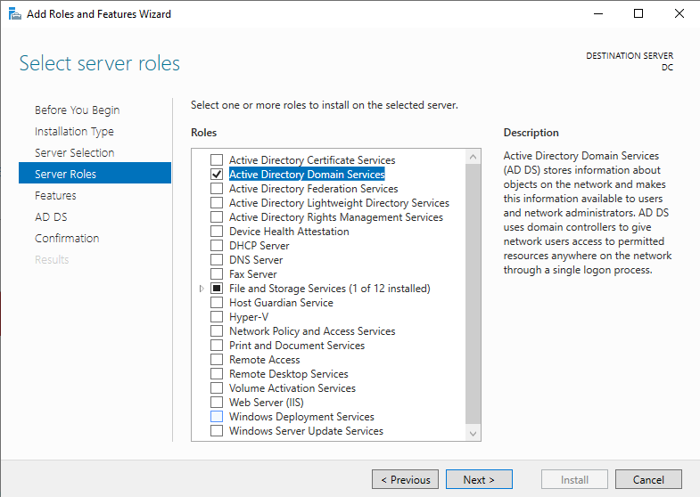

Selecting the role prompts to install its required management tools:

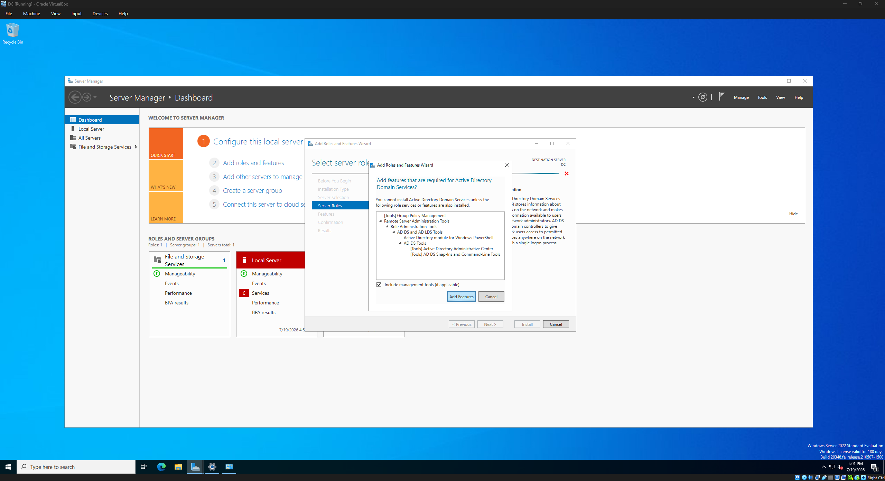

These tools form the admin toolkit used throughout the rest of the lab:
- **Group Policy Management**: where GPOs are created and linked
- **AD DS Snap-Ins and Command-Line Tools**: includes **Active Directory Users and Computers (ADUC)** for managing OUs, users, groups, password resets and unlocks
- **Active Directory Administrative Center**: the newer administration GUI
- **Active Directory module for Windows PowerShell**: provides the `New-ADUser` cmdlet used later for bulk provisioning

Installing the role only puts the software on the server. It's not a domain controller yet. Promoting it is a separate step, which tripped me up at first because I assumed installing the role was the whole thing.

---

### 8. Promoted the Server to a Domain Controller
Ran the post-deployment **"Promote this server to a domain controller"** task and selected **Add a new forest**, creating the root domain **`mydomain.com`**.

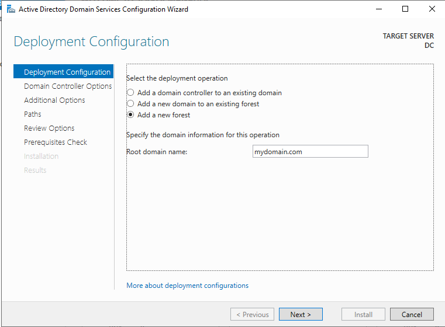

- DNS Server gets installed automatically as part of the promotion
- I set a DSRM password, which is a recovery password used if the directory database ever gets corrupted
- The DNS delegation warning during the wizard is normal. There's no parent DNS zone for `mydomain.com` because it isn't a real internet domain

The server rebooted automatically and returned as the domain controller for `mydomain.com`.

**Confirmation the promotion succeeded:**

Server Manager now shows AD DS and DNS in both the sidebar and the role tiles. DNS came along automatically with the promotion, which makes sense once you know clients find domain controllers through DNS records.

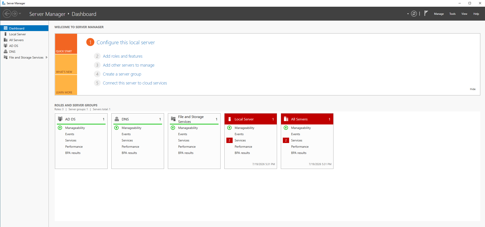

The sign-in screen now says `MYDOMAIN\Administrator` instead of just a local account name. That was the clearest sign to me that it worked. Logins are being checked against the domain now, not against the machine's own list of accounts.

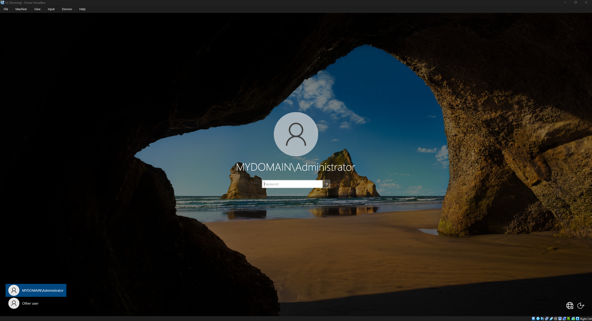

---

### 9. Created a Dedicated Domain Admin Account
Rather than continuing to work as the built-in Administrator, I created a named administrative account.

First, an **Organizational Unit** named `_admins` was created under `mydomain.com` (with "Protect container from accidental deletion" unchecked for lab convenience). Then a user account was created inside it using an `a-` prefix naming convention to identify it as an administrative account.

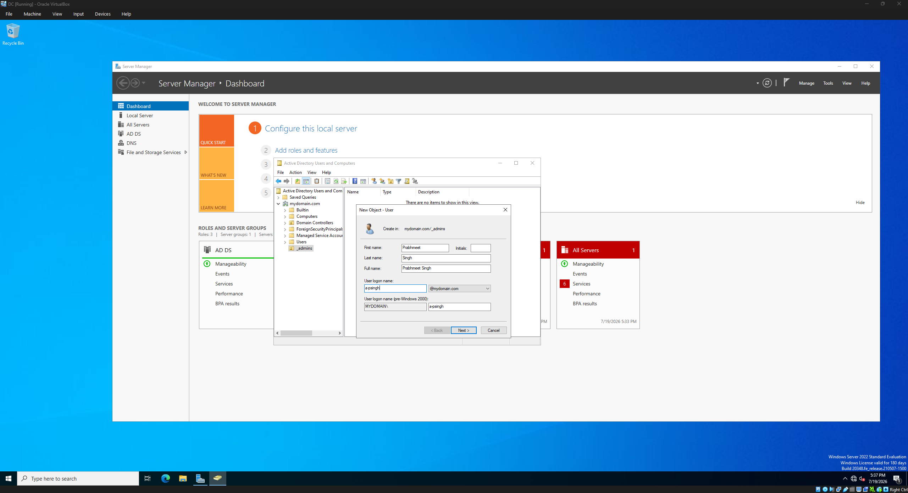

| Field | Value |
|---|---|
| Created in | `mydomain.com/_admins` |
| User logon name | `a-psingh@mydomain.com` |
| Pre-Windows 2000 | `MYDOMAIN\a-psingh` |

The account was then added to the built-in **`Domain Admins`** security group via **Properties → Member Of → Add**.

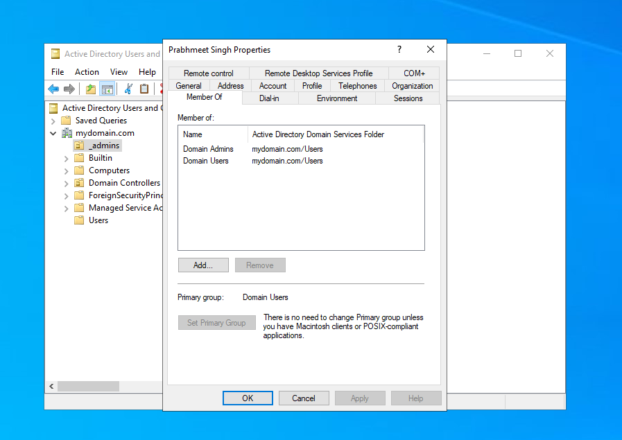

Working as the built-in Administrator every day isn't a good habit. Everybody knows that account name so it's an obvious target, and anything it does can't be traced back to a specific person. A named admin account fixes both of those.

> ### Something that clicked here: an OU doesn't give you permissions
> Adding the account to `Domain Admins` is where this finally made sense to me. In the screenshot, the groups live in `mydomain.com/Users` while my account lives in `mydomain.com/_admins`. Two completely different places.
>
> The OU (`_admins`) just decides where the object sits. It's also what lets you link Group Policy to it later. It grants nothing on its own.
>
> The security group (`Domain Admins`) is what actually gives the rights.
>
> My account would still be a domain admin no matter which OU I put it in, and a user sitting in `_admins` with no group membership would have no extra rights at all. The `a-` prefix is just a naming habit so I can tell at a glance that it's an admin account. It doesn't do anything by itself.

---

### 10. Set Up Routing and NAT
I installed the Remote Access role with the Routing service, then set up NAT so the client on the internal network could reach the internet through the domain controller.

The DC sits between two networks. The `Internet` adapter (`10.0.2.15`) faces outward, and the `Internal` adapter (`172.16.0.1`) serves the lab network. NAT translates between them so an internal client with a private address can get out.

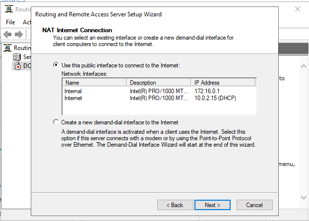

I picked `Internet` as the public interface. This is where renaming the adapters back in Step 4 paid off. Both of them show up as "Intel(R) PRO/1000 MT," so without the names I'd have been guessing, and picking `Internal` would have had NAT pointed the wrong way entirely.

---

> ## Case Study: The RRAS Wizard Was Broken, Not My Config
>
> This didn't work the first time, and figuring out why taught me more than the step itself.
>
> **First problem.** On the NAT Internet Connection page, the Network Interfaces list was completely empty and "Use this public interface" was greyed out. The wizard had defaulted to "Create a new demand-dial interface," which is for modem and PPPoE connections. If I'd gone along with it, NAT would have been bound to an interface that doesn't exist.
>
> 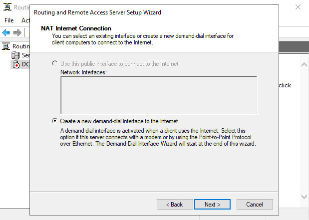
>
> **Second problem.** I cancelled and reopened the wizard. This time the interface list filled in, but the radio button for it was still greyed out. So the data had refreshed and the control hadn't.
>
> 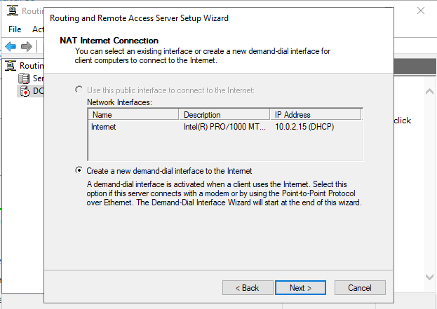
>
> **Then it crashed.** MMC threw a snap-in error, which is what told me the console itself had failed rather than anything being wrong with my network setup.
>
> 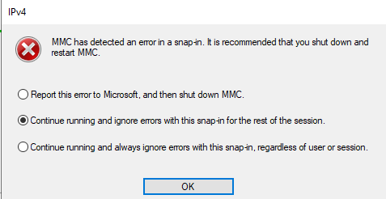
>
> **What was actually happening.** The RRAS snap-in got stuck in a bad state after I cancelled the wizard partway through. Its interface stopped matching the real configuration underneath. Every symptom looked exactly like I'd misconfigured something, but nothing was actually wrong.
>
> **How I fixed it.** Closed the console and restarted the server VM. On a clean boot the wizard worked on the first try and listed both adapters correctly, `Internal` at 172.16.0.1 and `Internet` at 10.0.2.15, with the public interface option available.
>
> **What I took from it.** When a management console is acting strange, check whether the tool has broken before you assume your configuration is wrong. A crashed snap-in looks identical to a misconfiguration from the outside. If I'd started tearing apart the network settings I would have spent an hour chasing a problem that wasn't there.

---

### 11. Installed and Configured DHCP
Installed the **DHCP Server** role so client machines on the internal network receive their addressing automatically instead of requiring manual configuration on every machine.

Created a scope covering the client address range:

| Setting | Value |
|---|---|
| Scope range | `172.16.0.100 – 172.16.0.200` |
| Subnet mask | `255.255.255.0` (/24) |
| Lease duration | 8 days (default) |

Three options are delivered to clients along with their address:

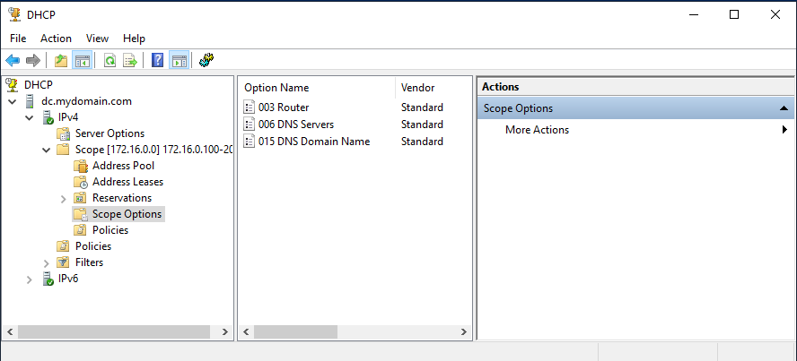

| Option | Value | Why it matters |
|---|---|---|
| **003 Router** | `172.16.0.1` | The default gateway. Without it a client gets an address but has no way out of the local subnet. |
| **006 DNS Servers** | `172.16.0.1` | Points clients at the DC for name resolution. Without it a client can't find or join the domain, since the DC is the only DNS server that knows `mydomain.com` exists. |
| **015 DNS Domain Name** | `mydomain.com` | Gives clients the domain suffix so short names like `dc` resolve without typing `dc.mydomain.com`. |

A DHCP server also has to be **authorized in Active Directory** before it's allowed to hand out leases. Skipping that is what broke my client later, which is the case study in Step 13.

DHCP options can be set at the server level, which covers every scope, or the scope level, which covers one range. Scope options win if both are set. I initially added the router option in Server Options, then realized the scope wizard had already set all three at the scope level, so the server-level entry did nothing. Setting the same value in two places is worth avoiding since it gets confusing when you need to change it later.

One thing that connected back: because I fixed the DC's mask to /24 earlier, the server and its DHCP clients agree on the network size. If I'd left the auto-filled /16 they wouldn't have.

---

### 12. Bulk-Created Users with PowerShell
Executed a **provided PowerShell script** to create approximately 1,000 Active Directory user accounts from a source name list.

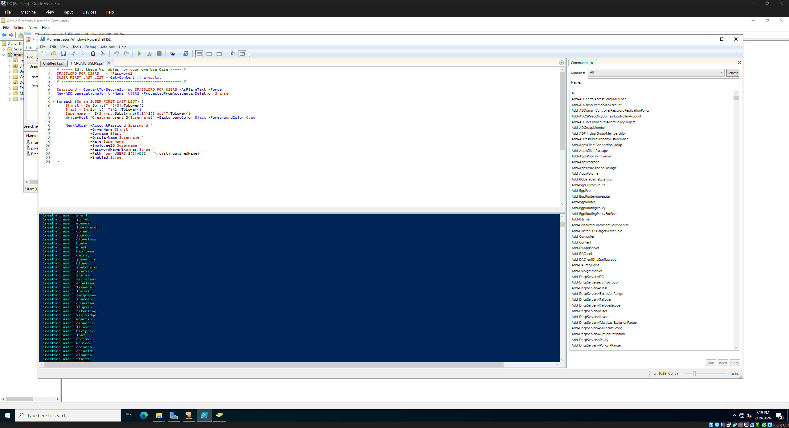

**What the script does:**
1. Reads a list of names from `names.txt` using `Get-Content`
2. Converts a plaintext password into a secure string with `ConvertTo-SecureString`
3. Creates a `_USERS` organizational unit via `New-ADOrganizationalUnit`
4. Loops through each name, splitting it into first and last name, then derives a username from the **first initial + last name** (e.g. *Prabhmeet Singh* → `psingh`)
5. Calls **`New-ADUser`** for each entry, placing the account in the `_USERS` OU with a default password and an enabled status

Making a thousand accounts by hand in the GUI isn't something anyone would finish. That's the actual reason admins script things. The script ran in under a minute.

Windows blocks unsigned scripts by default, so I had to run `Set-ExecutionPolicy Unrestricted` first. I also had to open PowerShell as Administrator, which I didn't do the first time and spent a few minutes confused about.

Here's the `_USERS` OU with all the accounts in it:

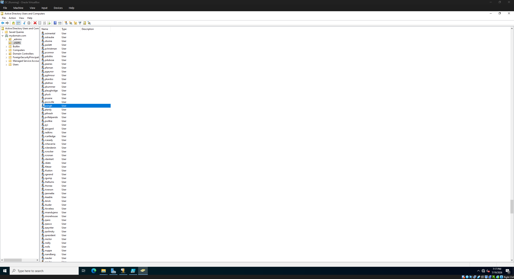

Searching the domain shows both account types, the standard user the script made and the admin account I created earlier:

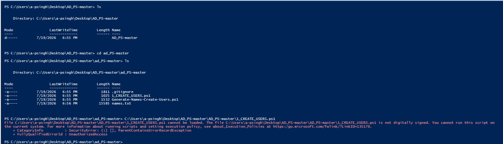

*Duplicate entries in the source name list produced errors for a small number of accounts; the script continued and completed successfully.*

---

### 13. Built the Windows 10 Client
I made a second VM called `Client1` running Windows 10 Pro 22H2, with one adapter on the same VirtualBox internal network as the DC. No NAT adapter, so its only way out is through the domain controller.

It has to be Pro. Windows 10 Home can't join a domain at all, which is a licensing thing and not something you can configure around.

On first boot the adapter said "Unidentified network" and the client had no usable address:

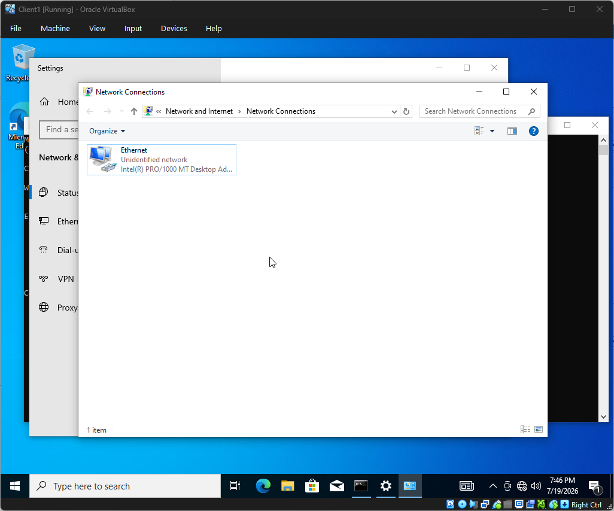

That's what a client looks like when it hasn't gotten DHCP yet. The case study below is how I sorted it out.

Once DHCP was actually working, `ipconfig` showed the client had everything it needed:

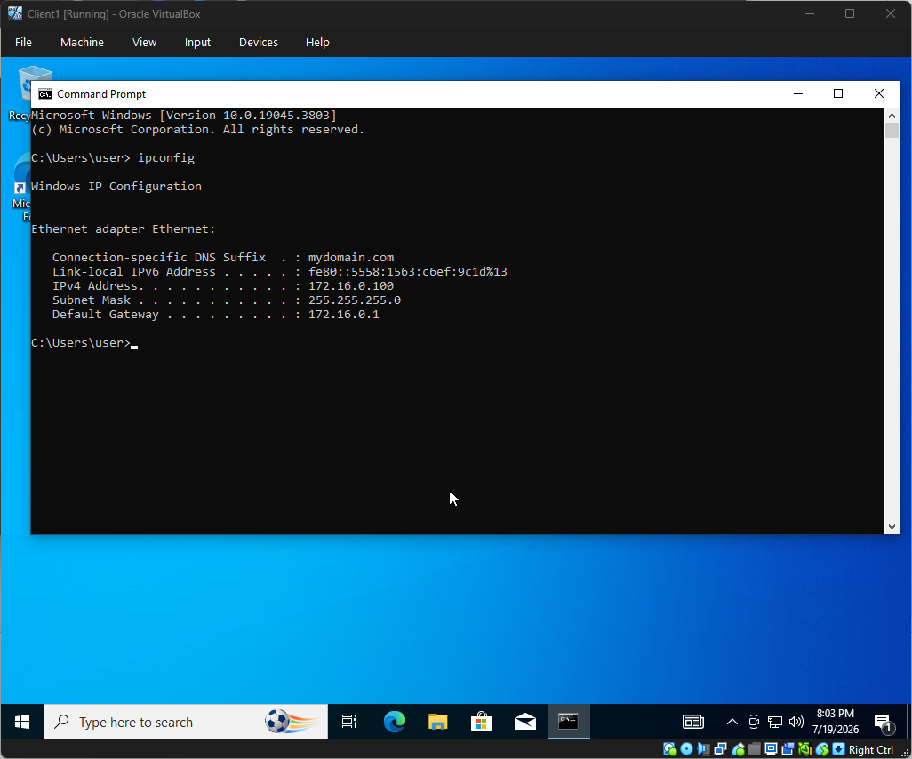

| Value | Result | Came from |
|---|---|---|
| IPv4 Address | `172.16.0.100` | DHCP scope |
| Subnet Mask | `255.255.255.0` | DHCP scope, matching the DC's /24 |
| Default Gateway | `172.16.0.1` | Option 003 Router |
| Connection-specific DNS Suffix | `mydomain.com` | Option 015 DNS Domain Name |

Every one of those traces back to an option I set in Step 11. That's what made me confident the scope was right. The client is basically a readout of the server's configuration.

---

> ## Case Study: The Client Was Stuck on an APIPA Address
>
> **What I saw.** Before the above, the client couldn't get an address at all. `ipconfig` came back with `169.254.100.172` and the adapter said "Unidentified network."
>
> **What that address means.** `169.254.x.x` is an APIPA address. Windows assigns it to itself when it asks for DHCP and nothing answers. That's actually useful, because it isn't a generic failure. It specifically means the client's networking is fine and it did ask, so the problem is the DHCP server or the path to it. That cut out half of what I would have otherwise checked.
>
> **What was wrong.** The DHCP role was installed and the scope was set up, but Server Manager was still showing a "Configuration required for DHCP Server at dc" notification. In a domain, a DHCP server has to be authorized in Active Directory before it's allowed to hand out leases. Mine was installed but never authorized, so it was running and quietly ignoring requests.
>
> **The fix.** Finished the DHCP post-install configuration to authorize it. The client pulled `172.16.0.100` right after.
>
> **What I took from it.** The authorization requirement isn't red tape. It's there so somebody can't plug a rogue DHCP server into a corporate network and take over clients by feeding them a bad gateway and DNS. The tradeoff is that it fails quietly on purpose, so the server never errors, it just stops answering. Knowing what APIPA meant is what turned this from "the client has no internet" into a two minute fix.

---

### 14. Joined the Client to the Domain
With DNS pointed at the DC, I joined `Client1` to `mydomain.com` through System, Rename this PC (Advanced), Change, Member of: Domain, using the admin account from Step 9.

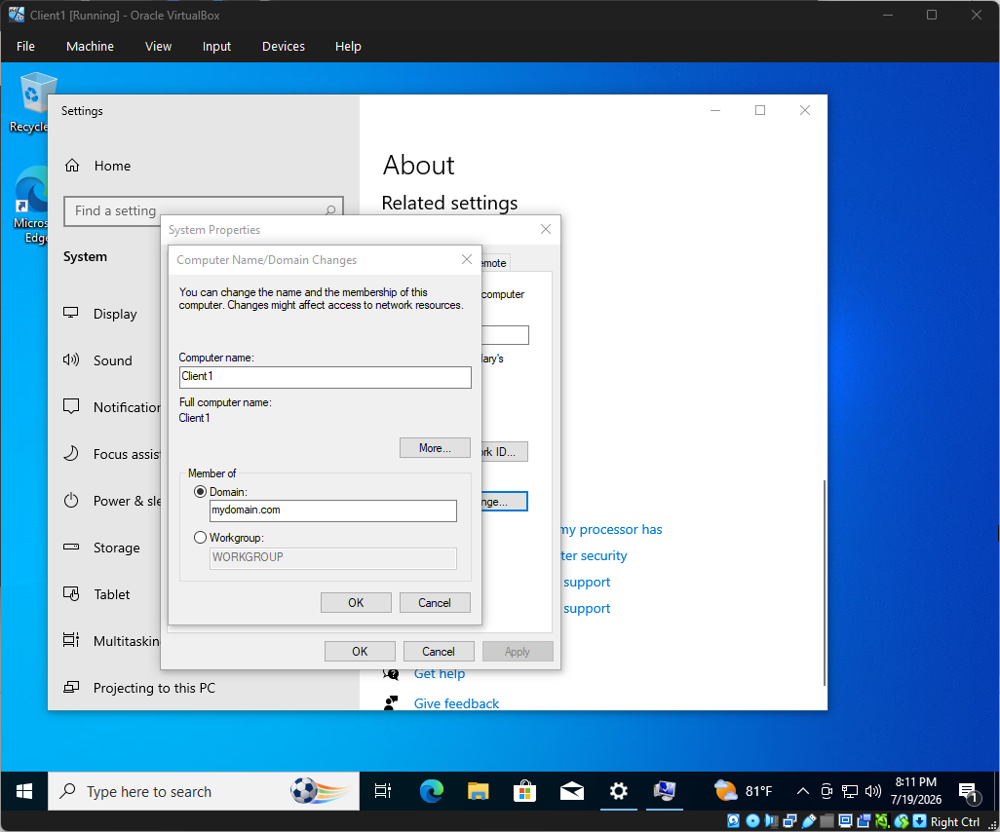


This step is completely dependent on DNS. A client finds a domain controller by asking DNS for SRV records under the domain name. It doesn't broadcast or scan for one. Because DHCP option 006 pointed the client at `172.16.0.1`, and that server knows about `mydomain.com`, the lookup worked and the join went through. If the client had been pointed at a public DNS server instead, I'd have gotten "the domain could not be contacted," which from what I've read is the most common reason a domain join fails.

---

### 15. Confirmed Domain Login Actually Works
I logged into the client with one of the domain accounts the PowerShell script made, not a local account, and checked from the command line:

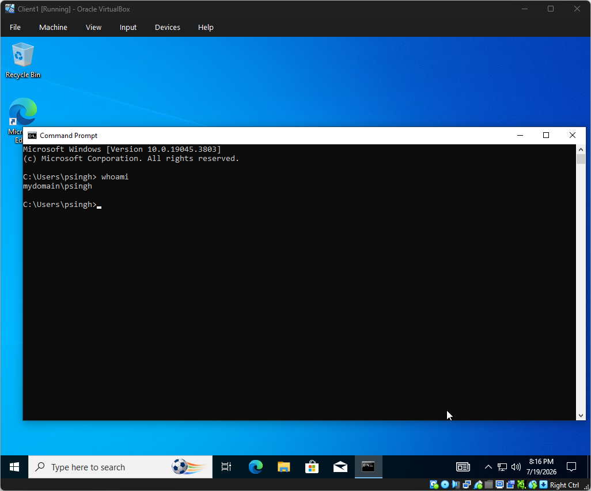

`whoami` came back as `mydomain\psingh`. The `mydomain\` part is the proof. That login was checked by the domain controller against Active Directory, not by the local machine's own accounts.

Confirmed the same event from the server side, where the DHCP console shows the active lease with the client's registered name:

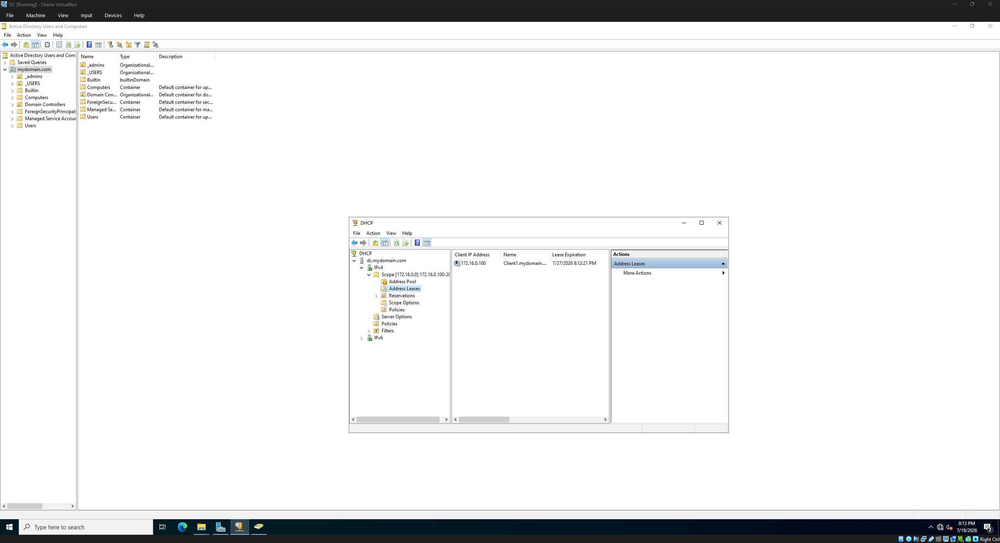

| Client IP Address | Name | Lease Expiration |
|---|---|---|
| `172.16.0.100` | `Client1.mydomain.com` | 7/27/2026 (8-day lease) |

The client shows up as `Client1.mydomain.com` with the full domain on the end, not just a bare hostname, which means it registered itself as a domain member. I wanted to check it from both sides. The client's view proves it thinks it joined, and the server's records prove the domain agrees.

---

### 16. Made a `_CLIENTS` OU and Moved the Client Into It
Before I could write any policy, I had to move the client somewhere policy could actually reach.

When I joined `Client1` to the domain, Windows put its computer object in the default `Computers` container. Looking at the Type column in ADUC, `Computers` and `Users` aren't Organizational Units, they're containers. You can't link a Group Policy to a container. Only sites, domains, and OUs work.

You can see this in the tool itself. The Group Policy Management Console doesn't even show `Computers` or `Users` in its tree, because it only lists things you can link to.

So I made an OU called `_CLIENTS` and moved `Client1` into it.

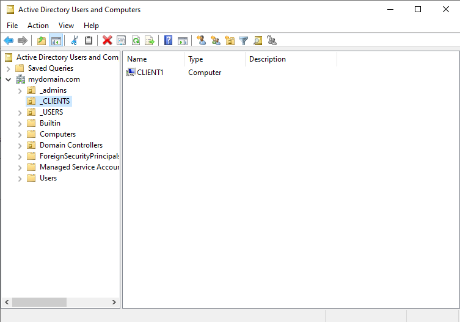

Every machine that joins a domain lands in `Computers` by default, so this isn't a lab quirk. Building an OU structure and moving machines into it is what makes them manageable at all.

Moving a computer object doesn't break anything. It keeps its name, its SID, and its machine account password, and the domain trust is unaffected. The only thing that changes is which policies can reach it.

---

### 17. Built and Linked Two Group Policy Objects
I made two policies, and they had to go in different places because of what each one does.

| GPO | Half of the GPO | Linked to | Why there |
|---|---|---|---|
| `Account Lockout Policy` | Computer | Domain root | Account policy only works domain-wide |
| `Restrict Control Panel - Standard Users` | User | `_USERS` OU | User setting, so it goes where the users are |

Every GPO is split into Computer Configuration and User Configuration, and the two halves get looked up separately. Computer settings apply based on where the computer object lives. User settings apply based on where the user object lives. When `psingh` logs into `Client1`, Windows does two lookups in two different parts of the directory. If you put a setting in the wrong half it doesn't error, it just never applies, which is what makes it easy to miss.

#### GPO 1: Account Lockout Policy, linked at the domain root

| Setting | Value | What it does |
|---|---|---|
| Account lockout threshold | `5` | Failed attempts before the account locks. Setting this to `0` means never lock, which caught me off guard since zero looks like the strictest option. |
| Account lockout duration | `15` minutes | How long it stays locked before it unlocks itself. |
| Reset account lockout counter after | `15` minutes | This is a rolling window, not a running total. The count resets after 15 minutes with no failures. |

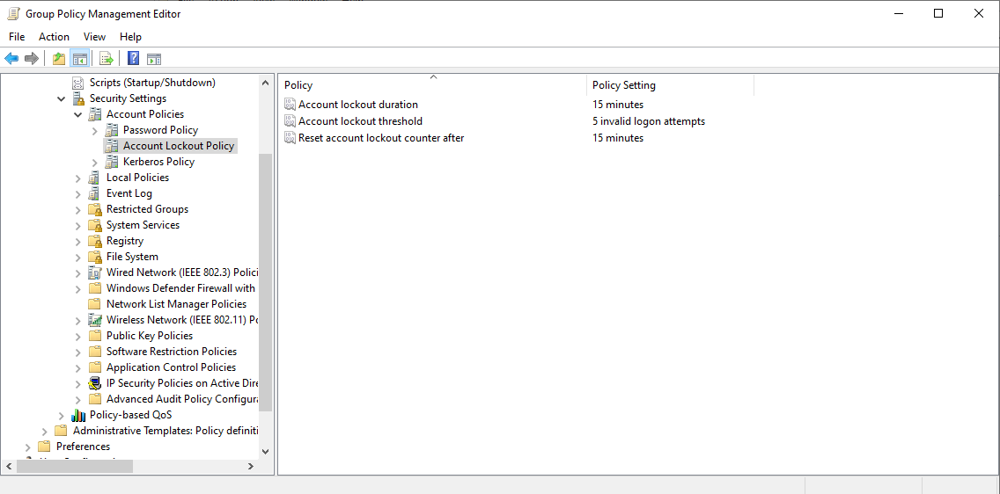

The reset window is the part I had to think about. With these numbers it takes 5 failures inside one 15 minute window. Somebody who gets it wrong twice in the morning and twice after lunch doesn't get locked out, which is the point. You're trying to stop something hammering the account, not punish a person having a bad day.

This one has to be linked at the domain root. Password and account lockout policy only apply to domain accounts when they're set at the domain level. Linked to an OU it does nothing to domain users, it only affects the local accounts on machines in that OU. I found this out the hard way, which is the case study below.

#### GPO 2: Restrict Control Panel, linked to `_USERS`

Enabled "Prohibit access to Control Panel and PC settings" under `User Configuration → Policies → Administrative Templates → Control Panel`.

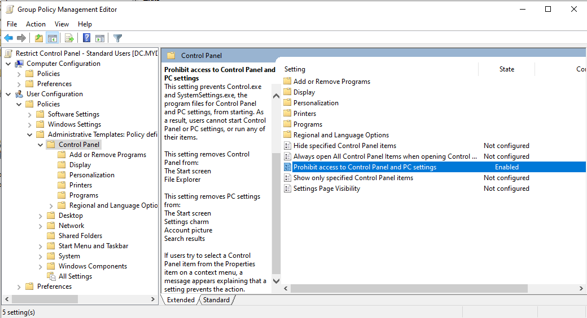

Administrative Templates is the section of Group Policy that writes registry settings on the target machine. It's separate from Security Settings, where the lockout policy lives, and the two work differently.

The scoping here does something useful. This GPO is linked to `_USERS`, which is where the roughly 1,000 standard accounts are. My admin account `a-psingh` sits in `_admins`, a different OU, so the restriction doesn't touch it. Standard users lose Control Panel and I keep it. That only works because I separated those accounts back in Step 9.

---

> ## Case Study: A Group Policy That Applied and Did Nothing
>
> I had the lockout policy set up correctly, `gpupdate /force` said it worked on both machines, and the GPO showed as applied. It did nothing at all.
>
> **What I saw.** Checking the domain's actual account policy gave me the untouched defaults instead of my values:
>
> 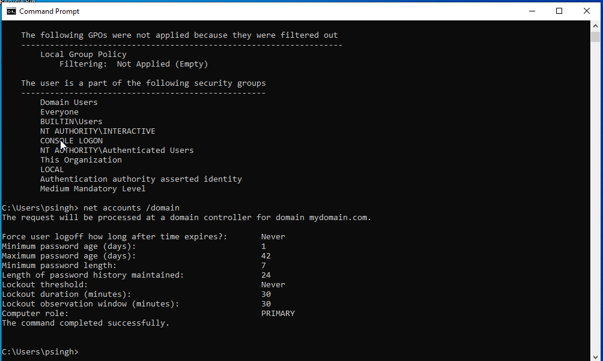
>
> ```
> Lockout threshold:                      Never      (expected: 5)
> Lockout duration (minutes):             30         (expected: 15)
> Lockout observation window (minutes):   30         (expected: 15)
> ```
>
> Nothing errored anywhere. Every tool said it worked.
>
> **Cutting down where to look.** Account lockout is enforced by the domain controller, not the client. The DC is what counts failed logins and decides to lock an account. So whatever was wrong wasn't on the client, which got half the environment out of the way before I tested anything.
>
> **Splitting it in two.** Two completely different problems look the same from here. Either the GPO never reached the DC, or it reached it and something overrode it. One command tells you which:
>
> ```
> gpresult /r /scope computer
> ```
>
> 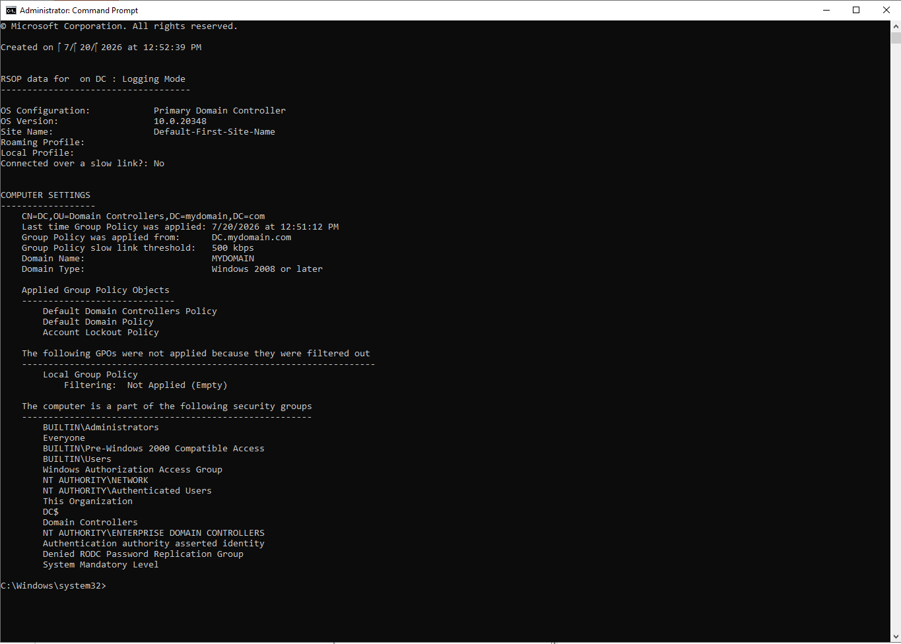
>
> ```
> Applied Group Policy Objects
>     Default Domain Controllers Policy
>     Default Domain Policy
>     Account Lockout Policy
> ```
>
> So it was applying, and nothing had filtered it out. That ruled out scoping and pointed at precedence instead.
>
> **Reading the output.** `gpresult` lists applied GPOs strongest first. I could tell that from the output itself, because `Default Domain Controllers Policy` is linked to the Domain Controllers OU, which is where the DC's own computer object lives, and policy linked closer to an object wins. So it has to be the strongest, and it's listed first. That meant `Default Domain Policy` was outranking my `Account Lockout Policy`.
>
> That mattered because a fresh Active Directory install already has account settings defined in the Default Domain Policy: threshold 0, duration 30, reset 30. Those are exactly the numbers I'd been looking at. They weren't defaults leaking through. Another GPO was actively winning.
>
> **Checking before changing anything.** Both GPOs are linked in the same place, so the tiebreaker is link order:
>
> 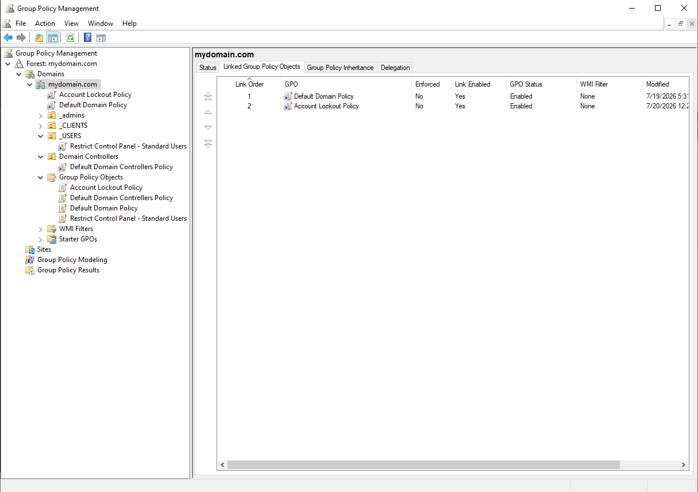
>
> That's what I expected to see. `Default Domain Policy` at link order 1, mine at 2. Lower number wins, because GPOs get applied highest number first, so the lowest one is written last and has the final say.
>
> **The fix.** Moved `Account Lockout Policy` to link order 1. One change, nothing else touched:
>
> 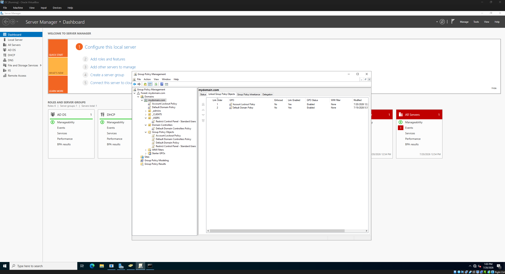
>
> 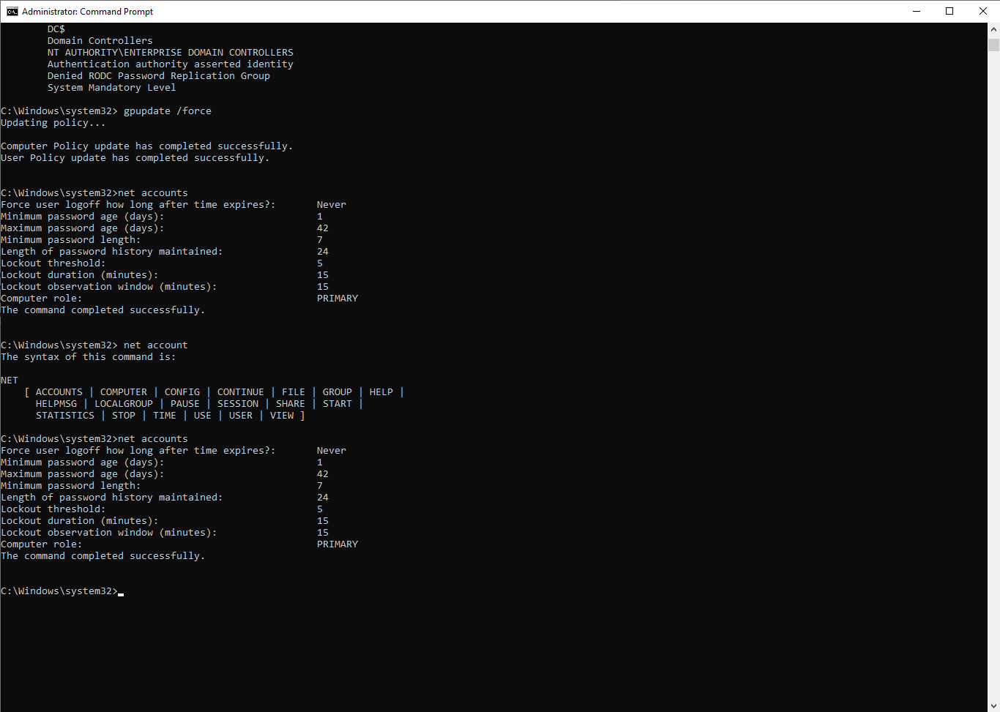
>
> ```
> Lockout threshold:                      5
> Lockout duration (minutes):             15
> Lockout observation window (minutes):   15
> ```
>
> **The part that surprised me.** Look at the Modified column in the link order table. The GPO I'd just made got put at the bottom of the link order automatically. So a new GPO is the weakest one at its container by default, which is the opposite of what I assumed. I figured the thing I just built on purpose would be the thing that wins.
>
> **What I took from it.** I worked out what was wrong and predicted it before touching anything. `gpresult` told me whether it was arriving or being overridden, the link order table confirmed it, and then one change fixed it. If I'd just started guessing, reordering links, editing the default policy, rebuilding the GPO, I might have ended up with something that worked and still not known why it broke.
>
> One more thing. I made a separate GPO instead of editing the Default Domain Policy so I wouldn't touch the built-in baseline. That decision is what caused the precedence conflict in the first place. It's also why a lot of people say to just put account policy in the Default Domain Policy. That advice isn't habit, it's because a separate account policy GPO has to win a precedence fight against a baseline that already has those settings in it.

---

### 18. Checked That the Policies Actually Reached the Client
First, confirming the user policy applied:

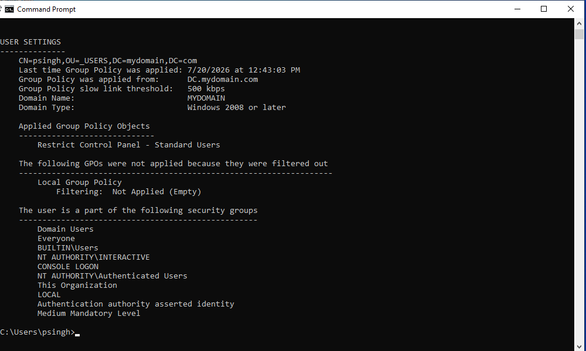

```
CN=psingh,OU=_USERS,DC=mydomain,DC=com
...
Applied Group Policy Objects
    Restrict Control Panel - Standard Users
```

The first line is the account's full path in the directory, and it shows `psingh` sitting in `_USERS`. Four lines down is the GPO that applied. Those two things are cause and effect. The policy applied because that's where the user object lives. The output also says `Group Policy was applied from: DC.mydomain.com`, so it came from the domain controller over the network and not from anything set locally.

Worth knowing: run `gpresult` from a normal prompt, not an elevated one. It reports on whoever is running it, so in an admin prompt you get the admin account's policy instead of the logged-in user's, and a policy that applied fine looks like it failed.

Applied and actually working aren't the same claim, so I tested the restriction directly:

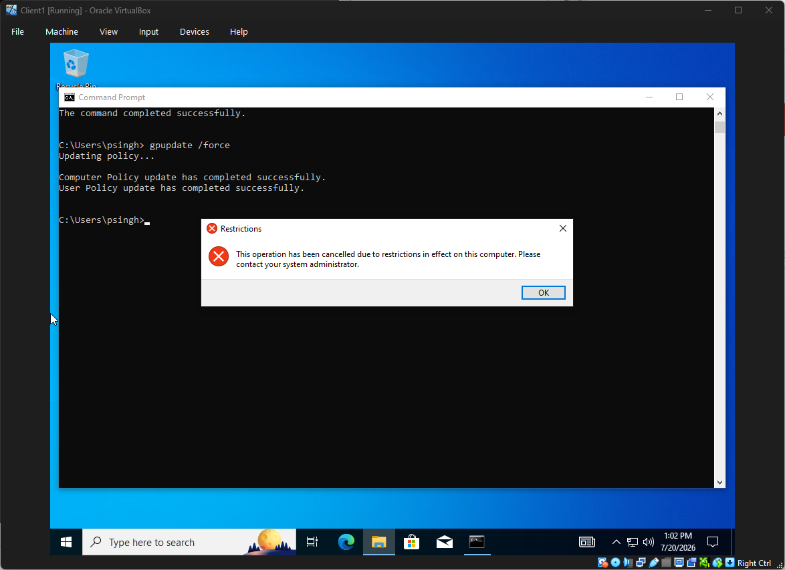

> "This operation has been cancelled due to restrictions in effect on this computer. Please contact your system administrator."

The computer policy I confirmed with `net accounts` on the DC, which is in the case study above.

If you check from the client instead, use `net accounts /domain`. Plain `net accounts` reports the local machine's own account policy, which domain policy never touches, so it comes back saying `Lockout threshold: Never` and looks like a failure. That threw me for a minute. It's the same local versus domain account distinction showing up in the tools.

---

## Verification & Testing

| Test | Method | Result |
|---|---|---|
| Domain controller promoted | Sign-in screen reads `MYDOMAIN\Administrator`; Server Manager lists AD DS + DNS | Confirmed |
| Client receives DHCP addressing | `ipconfig` on `Client1` | `172.16.0.100 /24`, gateway `172.16.0.1` |
| DHCP options delivered correctly | `ipconfig` gateway and DNS suffix match the configured scope options | Gateway `172.16.0.1`, suffix `mydomain.com` |
| Server issued and recorded the lease | DHCP console → Address Leases | `Client1.mydomain.com`, expires 7/27/2026 |
| Client joined the domain | System Properties → Change → Domain | "Welcome to the mydomain.com domain" |
| Domain authentication works | Signed in as a script-created domain user, ran `whoami` | Returned `mydomain\psingh` |
| Bulk user provisioning | ADUC → `_USERS` OU | ~1,000 accounts created |
| Admin account has domain rights | ADUC → account Properties → Member Of | Member of `Domain Admins` |
| NAT routing functional | Downloaded files on the DC across the NAT adapter | Outbound traffic working |
| Computer GPO reaches the DC | `gpresult /r /scope computer` on the DC | `Account Lockout Policy` listed as applied |
| Account lockout policy enforced | `net accounts` on the DC | Threshold `5`, duration `15`, reset `15` |
| User GPO reaches the client | `gpresult /r` on `Client1` as `psingh` | `Restrict Control Panel` listed as applied |
| User GPO actually enforced | Attempted to open Control Panel as `psingh` | Blocked with a restrictions message |
| Admin account exempt from the restriction | `a-psingh` sits in `_admins`, outside the GPO's link | Not restricted, since the policy only reaches `_USERS` |

---

## What I Understand Now

These are the things that only made sense to me after building it. I've kept this to what I actually ran into.

**A domain controller is the server that says yes or no to every login.** It holds the Active Directory database. Without it nobody signs in. That's the difference from a workgroup, where every machine keeps its own list of accounts and nothing is shared.

**DNS is what makes any of it work.** The client doesn't find the domain by broadcasting or scanning, it asks DNS. That's why the DC runs DNS, why it needs a static IP, and why DHCP has to hand out the DC's address as the DNS server. When my client couldn't join, it was a DNS path problem. If something in AD is broken now, DNS is the first place I'd look.

**An OU organizes, a security group grants access.** I mixed these up early on. I put my admin account in an `_admins` OU and assumed that gave it rights. It didn't. Adding it to the `Domain Admins` group is what gave it rights. The OU only decides where the object sits and which Group Policy reaches it. Location isn't permission.

**`Users` and `Computers` aren't OUs.** They look the same in the console but they're containers, and you can't link a Group Policy to a container. When I joined my client to the domain, its computer object landed in `Computers`, where no policy could reach it. I had to make a real OU and move it there before I could manage it.

**Group Policy is pulled, not pushed, and it keeps reapplying.** Machines ask for policy at boot, at login, and roughly every 90 minutes after that. That's what makes it an actual control instead of a suggestion. If someone changes a setting back, it gets overwritten again on the next refresh.

**Computer settings and user settings get looked up separately.** A GPO has two halves. The computer half applies based on where the computer object lives, the user half based on where the user object lives. When I logged into my client those were two different OUs. Putting a setting in the wrong half is the mistake I'd watch for, because it doesn't throw an error, it just never applies.

**When two policies collide, the lower link order wins.** This is the one that cost me real time. A new GPO gets added at the bottom of the link order, which makes it the weakest one by default. That's the opposite of what I assumed. My lockout policy was getting overwritten by the Default Domain Policy until I moved it to link order 1.

**Password and lockout policy has to be set at the domain level.** Linking it to an OU does nothing for domain accounts. I only found that out because mine didn't work.

---

## Problems I Ran Into

| Problem | What was going on | What I did |
|---|---|---|
| VirtualBox turned on "Unattended Installation" by itself | It defaults to that when you attach a Windows ISO | Unchecked it so I could pick the edition myself instead of ending up on Server Core |
| `Ctrl + Alt + Delete` never reached the VM | The host machine grabs it first | Used `Input → Keyboard → Insert Ctrl-Alt-Del`. Host key is `Right Ctrl` |
| Windows filled in the wrong subnet mask | Typing `172.16.0.1` made it assume `255.255.0.0` (/16) from the old classful rules | Set it to `255.255.255.0` manually so the DC and its DHCP clients agree on the network size |
| Installer offered an edition with no GUI | Plain "Standard" is Server Core. Only "(Desktop Experience)" has a GUI | Picked Desktop Experience |
| Password got rejected during setup | Windows Server enforces complexity | Used 8+ characters with upper and lower case, a number, and a symbol |
| `Internal` adapter says "Unidentified network" | No gateway or internet on that NIC, which is intentional | Nothing. It's expected, not an error |
| RRAS wizard showed an empty interface list, then crashed | The MMC snap-in got stuck in a bad state after I cancelled the wizard partway | Restarted the server VM. Worked first try after that. Case study in Step 10 |
| VM froze during the DHCP install | Not enough CPU. It was running on 2 vCPU | Bumped it to 4 cores and the install finished fine |
| "Access Denied" on admin commands while logged in as a Domain Admin | UAC gives every admin a filtered standard-user token by default. Having admin rights and running with them are two different things | Opened the console with Run as administrator. This got me twice, once with the PowerShell script and once with `gpresult /scope computer` |
| PowerShell script wouldn't run, "not digitally signed" | Two things at once: the execution policy, and I hadn't opened PowerShell as admin | Ran it elevated, then `Set-ExecutionPolicy Unrestricted` |
| Script couldn't find its input file | The zip extracted into a nested folder, `AD_PS-master\ad_PS-master\` | `cd` into the inner folder so the script's path to `names.txt` worked |
| Errors on a few accounts during bulk creation | Duplicate names in the source list | Nothing needed. The script logged them and kept going |
| Client stuck on APIPA `169.254.100.172` | DHCP was installed but never authorized in Active Directory, so it was quietly ignoring requests | Finished the DHCP post-install configuration. Case study in Step 13 |
| GPO applied but did nothing | `Default Domain Policy` had a lower link order and was overwriting my settings | Moved my GPO to link order 1. Case study in Step 17 |
| Domain policy looked unset when I checked from the client | Plain `net accounts` shows the local machine's policy, not the domain's | Used `net accounts /domain` |
| Couldn't tell which adapter actually connects the two VMs | The Windows adapter name isn't what does it | Only the VirtualBox internal network name wires two VMs together. The Windows label is just a label |

---

## What I Learned

**Everything runs through DNS.** The client finds the domain by asking DNS. The DC needs a static IP because it *is* the DNS server. The domain join only worked because DHCP option 006 pointed the client at the right place. I'd read that most "the domain isn't working" tickets come back to DNS and it didn't mean much to me at the time. After building this it's obvious, because DNS touches every other piece.

**I learned more from the things that broke.** The two problems that took actual diagnosis taught me more than any of the steps that worked first try. The APIPA address wasn't a generic failure, `169.254.x.x` means specifically that nothing answered the DHCP request, which cut out half of what I would have checked. And the RRAS crash taught me to check whether the tool is broken before assuming my configuration is. Every symptom looked like I'd set something up wrong, and nothing was actually wrong.

**The quiet failures are the bad ones.** The wrong subnet mask wouldn't have errored. It would have shown up weeks later as connectivity that works sometimes, which is much harder to track down. DHCP authorization is the same. The server doesn't complain, it just stops answering. The problems that announce themselves are the easy ones.

**Where something lives isn't the same as what it can do.** Putting my admin account in an `_admins` OU gave it nothing. Adding it to the `Domain Admins` group is what gave it rights. OUs are for organizing and for applying policy, groups are for access. Mixing those up isn't just wrong wording, it's a real misunderstanding of how permissions work.

**Scripting isn't showing off, it's the only way some work gets done.** Nobody makes a thousand accounts by hand. The script took under a minute.

**Figure out what's wrong before you start changing things.** The Group Policy failure is the clearest example. It would have been easy to start reordering links and rebuilding the GPO until something worked, and I probably would have landed on a working setup without ever knowing why it broke. Instead one command told me whether the policy was arriving or being overridden, which turned a vague problem into something specific I could test. Then the fix was one change. That's the habit I'd most want to bring into a real job.

---

## Next Steps
- Add a second domain controller and observe AD replication
- Configure mapped network drives via Group Policy
- Deploy a file server with NTFS and share permissions driven by security groups
- Build a ServiceNow developer instance to pair directory administration with ITSM ticketing workflow

---

*Lab built and documented by Prabhi Singh*
